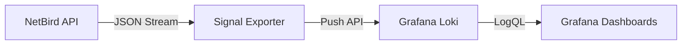

# Signal


Signal is a high-performance observability bridge that captures audit events from the NetBird Management API and forwards them to Grafana Loki. It enables real-time auditing, security monitoring, and visualization of network activity.

## Features

- **API-Driven**: Consumes the official NetBird Management API (Cloud & Self-Hosted).
- **Secure & Scalable**: Decoupled architecture with zero dependency on local filesystem or databases.
- **Stateful**: Intelligently tracks event cursors to ensure zero data loss or duplication across restarts.
- **Production Ready**: Built in Rust for memory safety, low footprint, and high reliability.

## Architecture



## Authentication

To use Signal, you need a Personal Access Token (PAT) from NetBird.

1. Go to your **NetBird Dashboard**.
2. Navigate to **Users**.
3. Select your user (or create a Service User).
4. Click on **Personal Access Tokens** > **Create Token**.
5. Copy the token immediately.

## Configuration

Signal is configured using environment variables.

| Variable | Description | Default |
|----------|-------------|---------|
| `NETBIRD_API_TOKEN` | Personal Access Token (PAT) | - |
| `NETBIRD_API_URL` | NetBird Management API Endpoint | `https://api.netbird.io` |
| `LOKI_URL` | Loki Push API Endpoint | `http://loki:3100` |
| `CHECK_INTERVAL` | Polling Frequency (seconds) | `10` |
| `RUST_LOG` | Log Verbosity | `info` |

## Deployment

### 1. Local (Cargo)

Best for development and testing.

```bash
# 1. Export configuration
export NETBIRD_API_TOKEN="nbp_your_token_here"
export LOKI_URL="http://localhost:3100"

# 2. Run
cargo run --release
```

### 2. Docker Standalone

Build and run the container manually.

```bash
# 1. Build
docker build -t signal .

# 2. Run
docker run -d --name signal \
  -e NETBIRD_API_TOKEN="nbp_your_token_here" \
  -e LOKI_URL="http://host.docker.internal:3100" \
  signal
```

### 3. Docker Compose

Add to your existing stack. This example builds directly from source.

```yaml
services:
  signal:
    build: .
    container_name: signal
    environment:
      - NETBIRD_API_URL=http://netbird-management/api
      - NETBIRD_API_TOKEN=${NETBIRD_PAT}
      - LOKI_URL=http://loki:3100
    restart: unless-stopped
    depends_on:
      - loki
```

## Observability

Signal enriches every event with structured metadata for querying.

### Log Labels

| Label | Description | Example |
|---|---|---|
| `job` | Component identifier | `netbird-events` |
| `activity` | Human-readable event name | `Group created` |
| `activity_code` | Machine-readable event code | `group.add` |
| `account_id` | Tenant/Account ID | `w89s7...` |

### Example Query (LogQL)

Find all user-related activities:

```logql
{job="netbird-events", activity_code=~"user.*"}
```

### Visualization


## License

Distributed under the MIT License. See `LICENSE` for more information.
