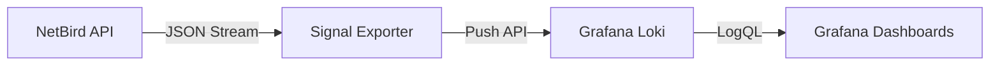

# Signal

[](https://github.com/onelrian/signal/actions)
[](https://hub.docker.com/r/onelrian/signal)
[](LICENSE)

Signal is a high-performance observability bridge for NetBird. It ingests audit events from the NetBird Management API and ships them directly to Grafana Loki, enabling real-time security monitoring, compliance auditing, and incident response.

## Features

- **Zero-Dependency Architecture**: Single binary or container; no local database or filesystem required.
- **Stateful Event Tracking**: Intelligently tracks event cursors to prevent data duplication or loss during restarts.
- **Universal Compatibility**: Works seamlessly with both NetBird Cloud and Self-Hosted instances.
- **Production Hardened**: Written in Rust for minimal memory footprint and high reliability.

## Architecture

Signal acts as a stateless, highly available middleware between your NetBird control plane and your observability stack.



## Prerequisites

### Required

- **NetBird Personal Access Token (PAT)**: Admin-level token with audit log read permissions.
- **Grafana Loki**: A reachable Loki instance (configured for ingestion).
- **Network Access**: Outbound HTTPS to NetBird API and Loki endpoints.

### Recommended for Production

- **Secrets Management**: Store `NETBIRD_API_TOKEN` in Kubernetes Secrets or Docker Secrets.
- **TLS**: Ensure `LOKI_URL` uses HTTPS if traversing public networks.

## Quick Start

### 1. Obtain NetBird PAT

1. Log in to your NetBird Dashboard.
2. Go to Users > Access Tokens.
3. Create a token and copy it (it is only shown once).

### 2. Deploy Signal

```bash
docker run -d --name signal \
  --restart unless-stopped \
  -e NETBIRD_API_TOKEN="nbp_your_token_here" \
  -e LOKI_URL="http://loki:3100" \
  ghcr.io/onelrian/signal:latest
```

## Production Deployment

### Configuration Reference

Signal is configured entirely via environment variables.

| Variable | Description | Default | Required |
|----------|-------------|---------|----------|
| `NETBIRD_API_TOKEN` | NetBird PAT with audit permissions | - | **Yes** |
| `LOKI_URL` | Loki push endpoint (HTTP/HTTPS) | `http://loki:3100` | No |
| `NETBIRD_API_URL` | NetBird API base URL (for Self-Hosted) | `https://api.netbird.io` | No |
| `CHECK_INTERVAL` | Event polling interval (seconds) | `10` | No |
| `RUST_LOG` | Log level (`error`, `warn`, `info`, `debug`) | `info` | No |

### Docker Compose (Production)

```yaml
version: '3.8'

services:
  signal:
    image: ghcr.io/onelrian/signal:latest
    container_name: signal
    restart: unless-stopped
    
    # Security
    read_only: true
    security_opt:
      - no-new-privileges:true
    cap_drop:
      - ALL
    
    # Environment
    environment:
      - NETBIRD_API_TOKEN=${NETBIRD_PAT}
      - LOKI_URL=http://loki:3100
      - CHECK_INTERVAL=30
      - RUST_LOG=info
    
    # Dependencies
    depends_on:
      - loki
    
    # Network
    networks:
      - monitoring

networks:
  monitoring:
    driver: bridge
```

### Kubernetes Deployment

Use a simple Deployment and Secret.

```yaml
apiVersion: apps/v1
kind: Deployment
metadata:
  name: signal
spec:
  replicas: 1
  selector:
    matchLabels:
      app: signal
  template:
    metadata:
      labels:
        app: signal
    spec:
      containers:
      - name: signal
        image: ghcr.io/onelrian/signal:latest
        env:
        - name: LOKI_URL
          value: "http://loki.monitoring.svc:3100"
        - name: NETBIRD_API_TOKEN
          valueFrom:
            secretKeyRef:
              name: netbird-secrets
              key: api-token
```


## Monitoring & Observability

Signal enriches every event with structured metadata for querying.

### Log Labels

| Label | Description | Example |
|---|---|---|
| `job` | Component identifier | `netbird-events` |
| `activity` | Human-readable event name | `Group created` |
| `activity_code` | Machine-readable event code | `group.add` |
| `account_id` | Tenant/Account ID | `w89s7...` |
| `initiator_email` | Actor who triggered the event | `admin@example.com` |


## License

Distributed under the MIT License. See [LICENSE](LICENSE) for more information.