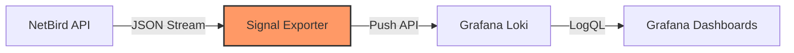
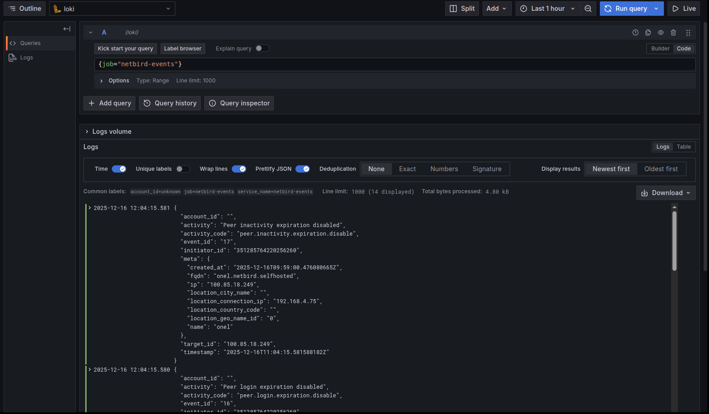

# Signal


Signal is a high-performance observability bridge that captures audit events from the NetBird Management API and forwards them to Grafana Loki. It enables real-time auditing, security monitoring, and visualization of network activity.

## Features

- **API-Driven**: Consumes the official NetBird Management API (Cloud & Self-Hosted).
- **Secure & Scalable**: Decoupled architecture with zero dependency on local filesystem or databases.
- **Stateful**: Intelligently tracks event cursors to ensure zero data loss or duplication across restarts.
- **Production Ready**: Built in Rust for memory safety, low footprint, and high reliability.

## Architecture



## Configuration

Signal is configured using environment variables.

| Variable | Description | Default | Required |
|----------|-------------|---------|----------|
| `NETBIRD_API_TOKEN` | Personal Access Token (PAT) | - | **Yes** |
| `NETBIRD_API_URL` | NetBird Management API Endpoint | `https://api.netbird.io` | No |
| `LOKI_URL` | Loki Push API Endpoint | `http://loki:3100` | No |
| `CHECK_INTERVAL` | Polling Frequency (seconds) | `10` | No |
| `RUST_LOG` | Log Verbosity | `info` | No |

## Deployment

### Docker Compose

Integrate seamlessly into an existing monitoring stack.

```yaml
services:
  signal:
    image: ghcr.io/onelrian/signal:latest
    container_name: signal
    environment:
      - NETBIRD_API_URL=http://netbird-management/api
      - NETBIRD_API_TOKEN=${NETBIRD_PAT}
      - LOKI_URL=http://loki:3100
    restart: unless-stopped
    depends_on:
      - loki
```

### Binary / Local

Ideal for development or bare-metal deployments.

```bash
# 1. Export configuration
export NETBIRD_API_TOKEN="nbp_your_token_here"
export LOKI_URL="http://localhost:3100"

# 2. Run
./signal
```

## Observability

Signal enriches every event with structured metadata for querying.

### Log Labels

| Label | Description | Example |
|---|---|---|
| `job` | Component identifier | `netbird-events` |
| `activity` | Human-readable event name | `Group created` |
| `activity_code` | Machine-readable event code | `group.add` |
| `account_id` | Tenant/Account ID | `w89s7...` |

### Example Query (LogQL)

Find all user-related activities:

```logql
{job="netbird-events", activity_code=~"user.*"}
```

### Visualization



## Contributing

Contributions are welcome. Please feel free to submit a Pull Request.

1. Fork the Project
2. Create your Feature Branch
3. Commit your Changes
4. Push to the Branch
5. Open a Pull Request

## License

Distributed under the MIT License. See `LICENSE` for more information.
